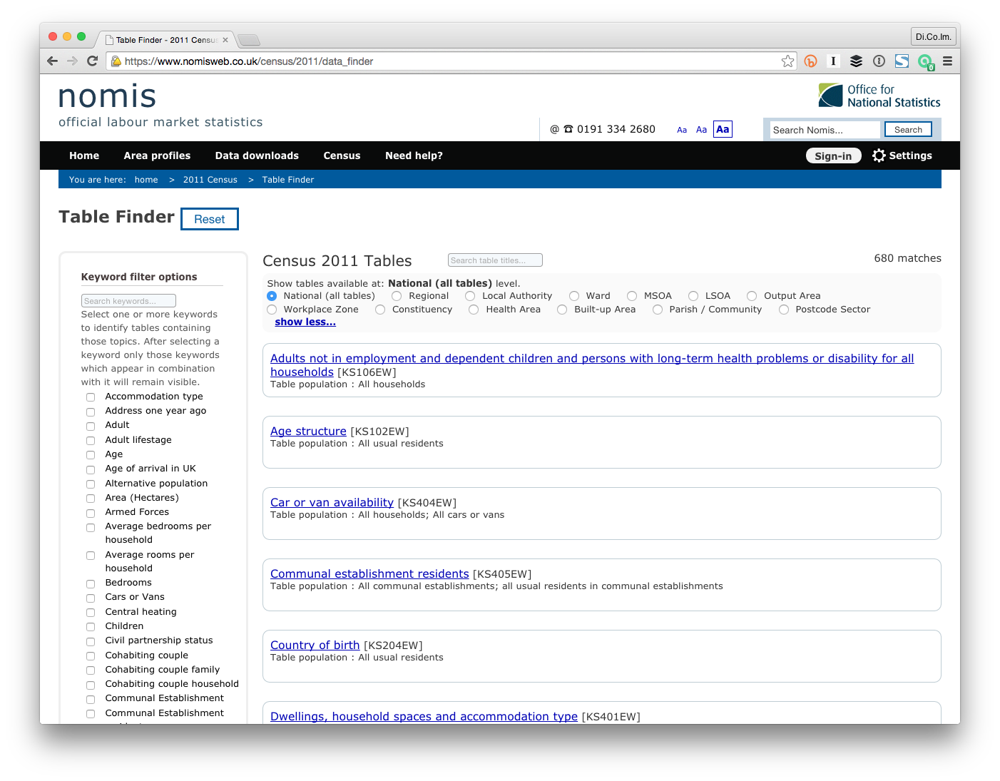
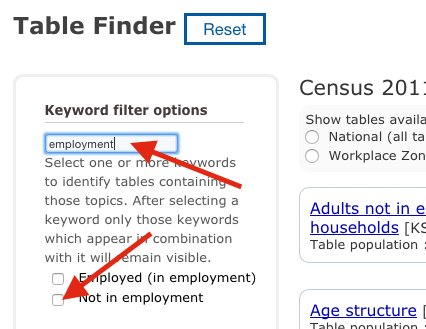
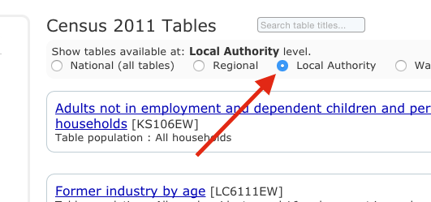
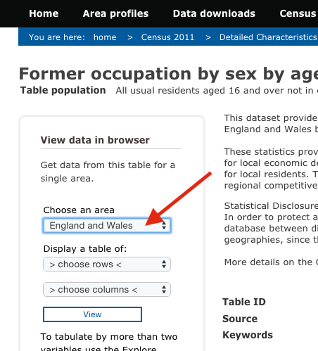
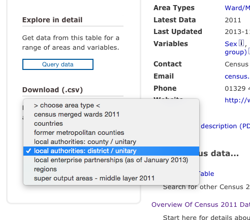

Merging data
============

##Introduction
This short document is intended to be a simple tutorial on how to merge data from different sources against the reference geography. It is important that you read about the reference geography first [here](https://hackpad.com/DataKind-UK-July-DataDive-2015-rrhiXtLhj1W).

##Sources
There are many sources for UK [open](http://opendefinition.org/) data relevant to your investigation. As a data scientist, finding what is most suitable to your research and preparing the data for integration across etherogeneous sources is part of the challenge itself.

###The 2011 Census
The census in 2011 is one of the most obvious starting points, as it is high quality data, relatively current, openly licensed and commonly considered to be anonymised to a degree not to trigger privacy violation issues, hence very safe.

This does not mean that it is always easy. The census data, for example, is collected vs the same UK-wide guidelines by the [UK Statistics Authority](http://www.statisticsauthority.gov.uk/) - which is good - but published by many country-focused institutions _and_ in a way that is not exclusive and not always consistent.

My personal favourite sources of Census 2011 data are:
- Durham University's "Nomis" website ([https://www.nomisweb.co.uk/census/2011](https://www.nomisweb.co.uk/census/2011)) for England and Wales, publishing data from the Office for National Statistics
- National Records of Scotland's "Scotland's Census" website ([http://www.scotlandscensus.gov.uk/](http://www.scotlandscensus.gov.uk/)) for Scotland, and
- Northern Ireland Statistics and Research Agency's (NISRA) website ([http://www.nisra.gov.uk/census/2011/results.html](http://www.nisra.gov.uk/census/2011/results.html))

##Prerequisites
We will use [R](http://www.r-project.org/) and the _dplyr_ and _data.table_ packages  for the examples below. You will probably be able to run the same exercise comfortably in MS Excel if you prefer to.

##Finally, the instructions!
Launch R and read the data into a data table _dt_:

```
> require(data.table)
> dt <- data.table(read.csv("../../uk_centrepoint_1507080040.csv", stringsAsFactors = F))
> head(dt)
     la_code              la_name population      area
1: E06000005           Darlington     105564  19747.51
2: E06000047        County Durham     513242 222606.26
3: E07000239          Wyre Forest      97975  19540.66
4: W06000002              Gwynedd     121874 253493.94
5: E06000001           Hartlepool      92028   9386.11
6: E06000056 Central Bedfordshire     254381  71566.45
```

Note how you can easily tell the UK countries from the first letter of the _la\_code_ column ('E' for England etc.). Area is expressed in hectares.

Now, let's imagine that we want to combine the data vs some statistical element described in the 2011 Census, e.g. we want to check if there is correlation between homelessness and unemployment. For England and Wales the data can be found on Nomis at [https://www.nomisweb.co.uk/census/2011/data_finder](https://www.nomisweb.co.uk/census/2011/data_finder).



We filter the data searching for "employment", find "Not in employment" and tick the box. Note that finding the data you need will not always be this straight forward, and you will inevitably do some trial and error!



We filter the available tables so to see only the ones that offer data aggregated at the local authority level:



Many tables are listed that include unemployment data, we will try using "Former occupation by sex by age", aka table "DC6113EW". The table describes people aged 16 and over who were not in employment the week before census day (27/05/2011).

Then, we select "England and Wales" as the scope:



... and that we want the data aggregated by local authority "district/unitary":



... and click on "Download". We'll download a _bulk.csv_ file, we load that in R, too and check what data is available. Note that the _geography.code_ column corresponds to _la\_code_ in our reference geography.

```
> census <- data.table(read.csv("~/Downloads/bulk.csv", stringsAsFactors = FALSE))
> names(census)
  [1] "date"
  [2] "geography"
  [3] "geography.code"
  [4] "Sex..All.persons..Former.occupation..Major.group...All.categories..Former.occupation..Age..All.categories..Age.16.and.over..measures..Value"
  [5] "Sex..All.persons..Former.occupation..Major.group...All.categories..Former.occupation..Age..Age.16.to.24..measures..Value"
  [6] "Sex..All.persons..Former.occupation..Major.group...All.categories..Former.occupation..Age..Age.25.to.34..measures..Value"
  (...)
```

Which columns you decide to explore here depends on your research hypothesis. For the sake of this example we will explore people who were between 25 and 34 years old and had never worked. We will drop all other columns and rename the remaining ones to something more manageable:

```
> census <- census[, c("geography.code", "Sex..All.persons..Former.occupation..Major.group...All.categories..Former.occupation..Age..Age.25.to.34..measures..Value", "Sex..All.persons..Former.occupation..Major.group...Never.worked..Age..Age.25.to.34..measures..Value"), with = FALSE]
> setnames(census, names(census), c("la_code", "unemployed_25_to_34", "never_worked_25_to_34"))
> head(census)
     la_code unemployed_25_to_34 never_worked_25_to_34
1: E06000005                2773                   609
2: E06000047               13090                  3001
3: E06000001                3167                   824
4: E06000002                6174                  2184
5: E06000048                6834                  1433
6: E06000003                3753                   874
```

Now we merge the data with the reference geography. Because I've conveniently renamed the column names to be consistent across the two tables, it is quite easy:

```
> require(dplyr)
> merged <- left_join(dt, census)
Joining by: "la_code"
> head(merged)
    la_code              la_name population     area unemployed_25_to_34 never_worked_25_to_34
1 E06000001           Hartlepool      92028  9386.11                3167                   824
2 E06000002        Middlesbrough     138412  5387.47                6174                  2184
3 E06000003 Redcar and Cleveland     135177 24489.51                3753                   874
4 E06000004     Stockton-on-Tees     191610 20393.06                5690                  1366
5 E06000005           Darlington     105564 19747.51                2773                   609
6 E06000006               Halton     125746  7909.52                3549                   650
```

Note how the other UK countries won't have values for the _unemployed\_25\_to\_34_ and _never\_worked\_25\_to\_34_ columns and will show _NA_ instead, because the Nomis website will only give us England and Wales data:

```
> head(merged[la_code %like% '^S',])
    la_code             la_name population   area unemployed_25_to_34 never_worked_25_to_34
1 S12000005    Clackmannanshire      51442  15864                  NA                    NA
2 S12000006 Dumfries & Galloway     151324 642620                  NA                    NA
3 S12000008       East Ayrshire     122767 126212                  NA                    NA
4 S12000010        East Lothian      99717  67918                  NA                    NA
5 S12000011   East Renfrewshire      90574  17379                  NA                    NA
6 S12000013         Eilean Siar      27684 305950                  NA                    NA
```

You take it from here, go play!

##Licence
This tutorial is licensed under [CC-BY 4.0 International](https://creativecommons.org/licenses/by/4.0/). No data is distributed or re-distributed with this tutorial but what is used in the examples. The code used in the tutorial is copyright (c) 2015 DataKind UK and licensed under the terms of the [MIT licence](LICENCE.md).
